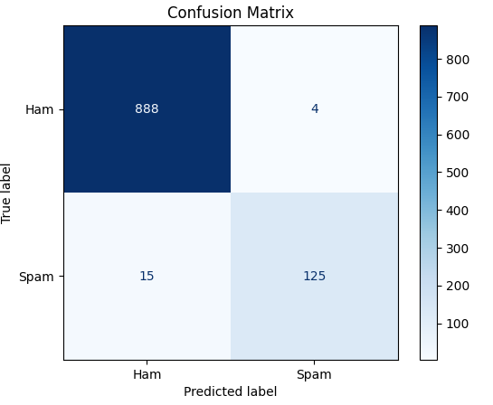

# **SPAM Detection Using NLP & Machine Learning**

## Overview
This project implements a Spam Detection System using Natural Language Processing (NLP) and Machine Learning. The goal is to automatically classify messages as Spam or Ham (non-spam) using Multinomial Naïve Bayes and TF-IDF features.

## Dataset
The dataset collected from [Kaggle]((https://www.kaggle.com/)). Load the data using pandas and view the Steps performed:

1. Load dataset using Pandas
2. Understand data structure
3. Check shape and format
4. Identify missing and null values
5. Analyze class distribution

## Approach

### Data Preprocessing:
   * Convert labels to numeric (ham=0, spam=1)
   * Split dataset into training (80%) and testing (20%) sets
   * Convert text to numerical features using TF-IDF
### Model Selection:
* Used Multinomial Naïve Bayes, which works efficiently for text classification
### Training & Evaluation:

* Model trained on TF-IDF features
* Predictions Evaluated using:

   * Accuracy
   * Precision, Recall, F1-score
   * Confusion Matrix

## Model Evaluation
```
1. Accuracy: 0.9815 (98.16%)
2. Classfication Report:
               precision    recall  f1-score   support

           0       0.98      1.00      0.99       892
           1       0.97      0.89      0.93       140

    accuracy                           0.98      1032
    macro avg       0.98      0.94      0.96      1032
    weighted avg       0.98      0.98      0.98      1032

3. Confusion Matrix: 
      [[888   4]
      [ 15 125]]
```
 

### Observations:
   * The model correctly identified 888 out of 892 ham messages
   * 125 out of 140 spam messages were correctly classified
   * Only 15 spam messages were misclassified as ham

>This shows that the model is very effective at detecting spam while maintaining high accuracy for normal messages.

## Key Features
   * Uses TF-IDF Vectorization to convert text messages into numerical features
   * Implements Multinomial Naïve Bayes, a simple and effective model for text classification
   * Handles imbalanced dataset efficiently

## Installation

1. Install required libraries
   * Numpy
   * Pandas
   * Scikit learn
   * Matplotlib
   * Seaborn
   * nltk

### How to Install
```
pip install numpy pandas scikit-learn matplotlib seaborn nltk
```
2. Load the dataset (spam.csv) in the same folder as the script.
3. Run the Python script:

```
python spam_detection.py
````
4. The Script will Output:   
   * Accuracy
   * Classification report
   * Confusion matrix
   * Sample prediction for custom messages

## Conclusion:
   * Naïve Bayes is highly effective for spam detection in text datasets.
   * The model achieved high accuracy (98%) and good recall for spam messages (0.89).
   * No threshold adjustment is needed — the model is already performing near optimally for this dataset.

> For future improvements, using n-grams, ensembles could further reduce missed spam messages.

## Author
* Keerthy


